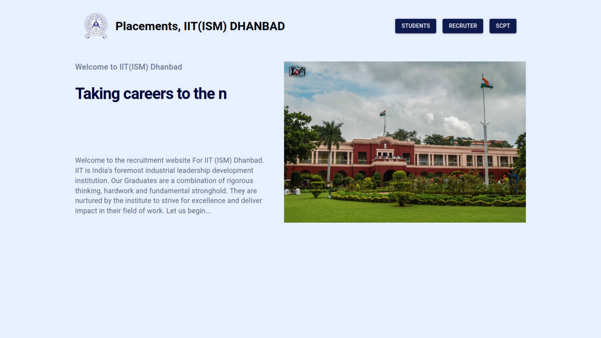

## Abstract
This project aims to create an CDC portal for our college that will provide a streamlined
and efficient platform to conduct the placement process by automating all the manual work involved in the process and eliminating the need for costly third-party websites(superset) currently which we are using (which do not provide flexibility) to improve the overall recruitment experience for all parties involved.

## Problem Statement
Currently, The placement and internship process at IIT(ISM) Dhanbad is mostly manual. SCPT members need to do a lot of manual work, and most of their time is wasted working with excel sheets.

On the student side, they use a third-party web app named 'superset', which comes with its own limitations.
Firstly, Superset is based on a subscription model and costs money, Secondly they don't provide any flexibility according to our needs and many of our requirements are still fulfilled manually.

On the company side, there is no such portal at all. Everything is done manually
through emails like sending them JNF/INF in word format, uploading these data to
superset, filtering the database and sending them a list of eligible students etc.
This is a serious problem as most of the time of SCPT members is wasted on these
redundant tasks instead of being utilized in grabbing new opportunities and thus
hampers the placement stats of the college.

# Solutions
* To solve these we will develop a cdc portal that will automate all the manual redundant work done by SCPT. This will allow us to have complete control over the user experience, as well as the features and functionality of the portal.
* With our own portal, we will have complete control over the data and can implement robust security measures to protect it. This can include using encryption technology to safeguard sensitive information like student resumes and contact information. We can also implement user authentication and authorization features to ensure that only authorized users have access to the data.
* To create a cost-effective solution, we can use open-source software and cloud-based infrastructure to reduce the upfront investment in hardware and software. This can include using popular frameworks and libraries like ReactJS or AngularJS for front-end development, and cloud-based databases like Amazon Web Services (AWS) or Google Cloud Platform (GCP) for back-end development. 

# Features

### Student Features:
* Students can Signup using their institute mail IDs.
* They can create their full profile on the portal so that they don't have to fill
them out repeatedly to apply to different companies.
* Students will be able to see the list of positions in which they are eligible to
apply according to the shortlisting criteria shared by the companies.
* Students will be able to apply for the positions they are interested in.
* They will be able to update their resume and profile as per their convenience.
* Gets statistics about jobs in the college
* Gets feed about recent placements
* Can favourite any job
* Gets important notifications on browser, mobile as well as on mail.

### Companies Features:
* Companies will receive the portal link from SCPT, which will contain all the
relevant details required by them and the placement brochure.
* Companies will be able to fill out the JNF/INF online by logging in with their
company profile.
* According to the criteria listed by the companies, students will be filtered
and notified so that they can start applying.
* Once the deadline for the application period is over, companies will be able
to view and download (in excel) the profile data and resumes of interested
eligible students.
* Companies will also be able to communicate important
information/announcements directly to the registered students.

# WebApp Screenshots

### Home Page

## Student Side Sections

## Recruiter Side Sections

